<div align="center">



[](https://git.io/typing-svg)

<br/>


&nbsp;&nbsp;

&nbsp;&nbsp;


</div>

---

## 🧠 About Me

```yaml
name     : Durgashankar Puhan
role     : Fullstack Developer & AI Engineer
location : India 🇮🇳
email    : durgashankarpuhan@gmail.com

passion  : Building systems that scale, perform, and last

expertise:
  - Generative AI, LLMs & Agentic AI Applications
  - Scalable Distributed & Event-Driven System Design
  - End-to-end Automation Pipelines
  - Cloud-native Architectures & Real-time Systems
  - Full-Stack Product Engineering

achievements:
  - 🏆 Winner — CodeFort AIThon 2025, Bhubaneswar
  - 🥈 4th Place — HackFest 2025, Dhanbad

fun_fact : "I don't just write code — I architect experiences."
```

---

## 🛠️ Tech Arsenal

<div align="center">

### 🌐 Frontend


### ⚙️ Backend & Languages


### 🗄️ Databases & Messaging


### 🤖 AI & LLMs


### 📈 Observability & Monitoring


### ☁️ DevOps, Cloud & CI/CD


</div>

---


## 📊 GitHub Stats

<div align="center">
  
  
</div>

<div align="center">
  
</div>

<div align="center">
  
</div>

---

## 🌐 Let's Connect

<div align="center">

[](https://linkedin.com/in/durgashankar-puhan)
[](https://leetcode.com/durga-sh)
[](https://instagram.com/puhandurgasankar)
[](mailto:durgashankarpuhan@gmail.com)

</div>

---

<div align="center">

### 💡 *"Great software isn't written — it's engineered, iterated, and crafted with intent."*


</div>
